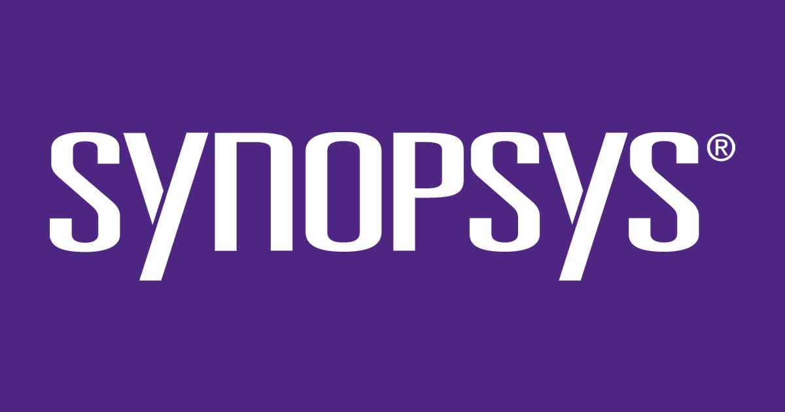

# Welcome to MkDocs

For full documentation visit [mkdocs.org](https://www.mkdocs.org).

## Commands

* `mkdocs new [dir-name]` - Create a new project.
* `mkdocs serve` - Start the live-reloading docs server.
* `mkdocs build` - Build the documentation site.
* `mkdocs -h` - Print help message and exit.

## Project layout

    mkdocs.yml    # The configuration file.
    docs/
        index.md  # The documentation homepage.
        ...       # Other markdown pages, images and other files.
# Welcome to My Documentation made by Yash

Welcome to our documentation site! Here you'll find all the information you need to get started with our products and services.

## Getting Started
  

If you're new here, this section will guide you through the process of getting started with our products. Whether you're a beginner or an experienced user, you'll find helpful resources to help you along the way.

- [Installation Guide](installation.md): Learn how to install and set up our products on your system.
- [Quick Start](quick-start.md): Get up and running quickly with our easy-to-follow quick start guide.
- [FAQs](faqs.md): Find answers to frequently asked questions about our products and services.

## Product Documentation

Explore our comprehensive product documentation to learn more about the features and capabilities of our products.

- [Product A User Manual](product-a.md): Dive deep into the user manual for Product A and discover its full potential.
- [Product B API Reference](product-b.md): Explore the API reference documentation for Product B and learn how to integrate it into your applications.

## Contact Us

If you have any questions, feedback, or inquiries, feel free to reach out to us. Our dedicated support team is here to assist you.

- Email: support@example.com
- Phone: 123-456-7890
- Live Chat: Visit our website to chat with a support representative in real-time.

Thank you for choosing our products and services. We hope you find our documentation helpful!

